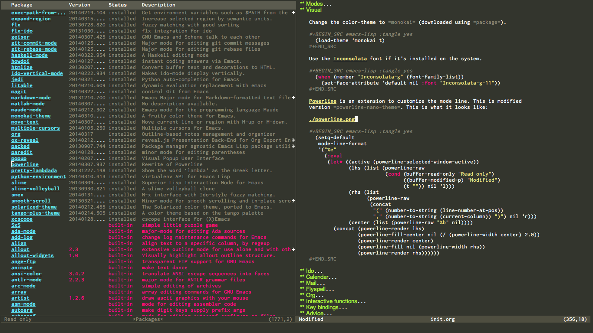

- [About](#about)
- [Configurations](#configurations)
  - [Meta](#meta)
  - [Package](#package)
  - [Mac OS X](#mac-os-x)
  - [Require](#require)
  - [Sane defaults](#sane-defaults)
  - [Modes](#modes)
  - [Visual](#visual)
  - [Ido](#ido)
  - [Calendar](#calendar)
  - [Mail](#mail)
  - [Flyspell](#flyspell)
  - [Org](#org)
  - [Interactive functions](#interactive-functions)
  - [Key bindings](#key-bindings)
  - [Advice](#advice)
  - [Presentation-mode](#presentation-mode)
- [Language mode specific](#language-mode-specific)
  - [Lisp](#lisp)
    - [Emacs Lisp](#emacs-lisp)
    - [Common lisp](#common-lisp)
    - [Scheme](#scheme)
  - [Java and C](#java-and-c)
  - [Assembler](#assembler)
  - [LaTeX](#latex)
  - [Markdown](#markdown)
  - [Python](#python)
  - [Haskell](#haskell)
  - [Matlab](#matlab)


# About<a id="sec-1" name="sec-1"></a>

This is an Emacs configuration file written in [Org mode](http://orgmode.org). It is an attempt
to keep my `~/.emacs.d` tidy, but still be able to keep it all in one
file. I aim to briefly explain all my configurations as I go along!

I would not recommend using this configuration *as-is*, because it
probably contains a lot you don't really need. I do, however, hope people
find some golden nuggets that they can smuggle into their own configs.

If you really do want to try this config out, this is how I'd go about it:

**Clone the repo.**

```sh
git clone https://github.com/larstvei/dot-emacs
```

**Backup your old `~/.emacs.d` (if necessary).**

```sh
mv ~/.emacs.d ~/.emacs.d-bak
```

**Backup your old `~/.emacs`-file (if necessary).**

```sh
mv ~/.emacs ~/.emacs-bak
```

**And finally**

```sh
mv dot-emacs ~/.emacs.d
```

On first run it should install a bunch of packages (this might take a
while), and you might have to restart your Emacs the first time. If you
experience bugs, please let me know!

# Configurations<a id="sec-2" name="sec-2"></a>

## Meta<a id="sec-2-1" name="sec-2-1"></a>

Emacs can only load `.el`-files. We can use `C-c C-v t` to run
`org-babel-tangle`, which extracts the code blocks from the current file
into a source-specific file (in this case a `.el`-file).

To avoid doing this each time a change is made we can add a function to
the `after-save-hook` ensuring to always tangle and byte-compile the
`org`-document after changes.

```lisp
(defun tangle-init ()
  "If the current buffer is 'init.org' the code-blocks are
tangled, and the tangled file is compiled."
  (when (equal (buffer-file-name)
               (expand-file-name (concat user-emacs-directory "init.org")))
    (org-babel-tangle)
    (byte-compile-file (concat user-emacs-directory "init.el"))))

(add-hook 'after-save-hook 'tangle-init)
```

## Package<a id="sec-2-2" name="sec-2-2"></a>

Managing extensions for Emacs is simplified using `package` which is
built in to Emacs 24 and newer. To load downloaded packages we need to
initialize `package`. `cl` is a library that contains many functions from
Common Lisp, and comes in handy quite often, so we want to make sure it's
loaded, along with `package`, which is obviously needed.

```lisp
(require 'cl)
(require 'package)
(setq package-enable-at-startup nil)
(package-initialize)
```

Packages can be fetched from different mirrors, [melpa](http://melpa.milkbox.net/#/) is the largest
archive and is well maintained.

```lisp
(setq package-archives
      '(("gnu" . "http://elpa.gnu.org/packages/")
        ("org" . "http://orgmode.org/elpa/")
        ("MELPA" . "http://melpa.milkbox.net/packages/")))
```

We can define a predicate that tells us whether or not the newest version
of a package is installed.

```lisp
(defun newest-package-installed-p (package)
  "Return true if the newest available PACKAGE is installed."
  (when (package-installed-p package)
    (let* ((local-pkg-desc (or (assq package package-alist)
                               (assq package package--builtins)))
           (newest-pkg-desc (assq package package-archive-contents)))
      (and local-pkg-desc newest-pkg-desc
           (version-list-= (package-desc-vers (cdr local-pkg-desc))
                           (package-desc-vers (cdr newest-pkg-desc)))))))
```

Let's write a function to install a package if it is not installed or
upgrades it if a new version has been released. Here our predicate comes
in handy.

```lisp
(defun upgrade-or-install-package (package)
  "Unless the newest available version of PACKAGE is installed
PACKAGE is installed and the current version is deleted."
  (unless (newest-package-installed-p package)
    (let ((pkg-desc (assq package package-alist)))
      (when pkg-desc
        (package-delete (symbol-name package)
                        (package-version-join
                         (package-desc-vers (cdr pkg-desc)))))
      (and (assq package package-archive-contents)
           (package-install package)))))
```

Also, we will need a function to find all dependencies from a given package.

```lisp
(defun dependencies (package)
  "Returns a list of dependencies from a given PACKAGE."
  (let* ((pkg-desc (assq package package-alist))
         (reqs (and pkg-desc (package-desc-reqs (cdr pkg-desc)))))
    (mapcar 'car reqs)))
```

The `package-refresh-contents` function downloads archive descriptions,
this is a major bottleneck in this configuration. To avoid this we can
try to only check for updates once every day or so. Here are three
variables. The first specifies how often we should check for updates. The
second specifies whether one should update during the initialization. The
third is a path to a file where a time-stamp is stored in order to check
when packages were updated last.

```lisp
(defvar days-between-updates 7)
(defvar do-package-update-on-init t)
(defvar package-last-update-file
  (expand-file-name (concat user-emacs-directory ".package-last-update")))
```

The tricky part is figuring out when packages were last updated. Here is
a hacky way of doing it, using [time-stamps](http://www.gnu.org/software/emacs/manual/html_node/emacs/Time-Stamps.html). By adding a time-stamp to the
a file, we can determine whether or not to do an update. After that we
must run the `time-stamp`-function to update the time-stamp.

```lisp
(require 'time-stamp)
;; Open the package-last-update-file
(with-temp-file package-last-update-file
  (if (file-exists-p package-last-update-file)
      (progn
        ;; Insert it's original content's.
        (insert-file-contents package-last-update-file)
        (let ((start (re-search-forward time-stamp-start nil t))
              (end (re-search-forward time-stamp-end nil t)))
          (when (and start end)
            ;; Assuming we have found a time-stamp, we check determine if it's
            ;; time to update.
            (setq do-package-update-on-init
                  (<= days-between-updates
                      (days-between
                       (current-time-string)
                       (buffer-substring-no-properties start end))))
            ;; Remember to update the time-stamp.
            (when do-package-update-on-init
              (time-stamp)))))
    ;; If no such file exists it is created with a time-stamp.
    (insert "Time-stamp: <>")
    (time-stamp)))
```

Now we can use the function above to make sure packages are installed and
up to date. Here are some packages I find useful (some of these
configurations are also dependent on them).

```lisp
(when (and do-package-update-on-init
           (y-or-n-p "Update all packages?"))
  (package-refresh-contents)

  (let* ((packages
          '(ac-geiser         ; Auto-complete backend for geiser
            ac-slime          ; An auto-complete source using slime completions
            ace-jump-mode     ; quick cursor location minor mode
            auto-compile      ; automatically compile Emacs Lisp libraries
            auto-complete     ; auto completion
            centered-window   ; Center the text when there's only one window
            elscreen          ; window session manager
            expand-region     ; Increase selected region by semantic units
            flx-ido           ; flx integration for ido
            idle-require      ; load elisp libraries while Emacs is idle
            ido-vertical-mode ; Makes ido-mode display vertically.
            geiser            ; GNU Emacs and Scheme talk to each other
            haskell-mode      ; A Haskell editing mode
            jedi              ; Python auto-completion for Emacs
            js2-mode          ; Improved JavaScript editing mode
            magit             ; control Git from Emacs
            markdown-mode     ; Emacs Major mode for Markdown-formatted files.
            matlab-mode       ; MATLAB integration with Emacs.
            monokai-theme     ; A fruity color theme for Emacs.
            move-text         ; Move current line or region with M-up or M-down
            multiple-cursors  ; Multiple cursors for Emacs.
            org               ; Outline-based notes management and organizer
            paredit           ; minor mode for editing parentheses
            powerline         ; Rewrite of Powerline
            pretty-lambdada   ; the word `lambda' as the Greek letter.
            slime             ; Superior Lisp Interaction Mode for Emacs
            smex              ; M-x interface with Ido-style fuzzy matching.
            undo-tree))       ; Treat undo history as a tree
         ;; Fetch dependencies from all packages.
         (reqs (mapcar 'dependencies packages))
         ;; Append these to the original list, and remove any duplicates.
         (packages (delete-dups (apply 'append packages reqs))))

    (dolist (package packages)
      (upgrade-or-install-package package)))

  ;; This package is only relevant for Mac OS X.
  (when (memq window-system '(mac ns))
    (upgrade-or-install-package 'exec-path-from-shell))
  (package-initialize))
```

## Mac OS X<a id="sec-2-3" name="sec-2-3"></a>

I run this configuration mostly on Mac OS X, so we need a couple of
settings to make things work smoothly. In the package section
`exec-path-from-shell` is included (only if you're running OS X), this is
to include environment-variables from the shell. It makes useing Emacs
along with external processes a lot simpler. I also prefer using the
`Command`-key as the `Meta`-key.

```lisp
(when (memq window-system '(mac ns))
  (setq mac-option-modifier nil
        mac-command-modifier 'meta
        x-select-enable-clipboard t)
  (run-with-idle-timer 5 nil 'exec-path-from-shell-initialize))
```

## Require<a id="sec-2-4" name="sec-2-4"></a>

Some features are not loaded by default to minimize initialization time,
so they have to be required (or loaded, if you will). `require`-calls
tends to lead to the largest bottleneck's in a
configuration. `idle-require` delays the `require`-calls to a time where
Emacs is in idle. So this is great for stuff you eventually want to load,
but is not a high priority.

```lisp
(require 'idle-require)             ; Need in order to use idle-require
(require 'auto-complete-config)     ; a configuration for auto-complete-mode

(dolist (feature
         '(auto-compile             ; auto-compile .el files
           jedi                     ; auto-completion for python
           matlab                   ; matlab-mode
           ob-matlab                ; org-babel matlab
           ox-latex                 ; the latex-exporter (from org)
           ox-md                    ; Markdown exporter (from org)
           pretty-lambdada          ; show 'lambda' as the greek letter.
           recentf                  ; recently opened files
           smex                     ; M-x interface Ido-style.
           tex-mode))               ; TeX, LaTeX, and SliTeX mode commands
  (idle-require feature))

(setq idle-require-idle-delay 5)
(idle-require-mode 1)
```

## Sane defaults<a id="sec-2-5" name="sec-2-5"></a>

These are what *I* consider to be saner defaults.

We can set variables to whatever value we'd like using `setq`.

```lisp
(setq default-input-method "TeX"    ; Use TeX when toggeling input method.
      doc-view-continuous t         ; At page edge goto next/previous.
      echo-keystrokes 0.1           ; Show keystrokes asap.
      inhibit-startup-message t     ; No splash screen please.
      initial-scratch-message nil   ; Clean scratch buffer.
      ring-bell-function 'ignore    ; Quiet.
      ;; Save undo history between sessions, if you have an undo-dir
      undo-tree-auto-save-history
      (file-exists-p
       (concat user-emacs-directory "undo"))
      undo-tree-history-directory-alist
      ;; Put undo-history files in a directory, if it exists.
      (let ((undo-dir (concat user-emacs-directory "undo")))
        (and (file-exists-p undo-dir)
             (list (cons "." undo-dir)))))

;; Some mac-bindings interfere with Emacs bindings.
(when (boundp 'mac-pass-command-to-system)
  (setq mac-pass-command-to-system nil))
```

Some variables are buffer-local, so changing them using `setq` will only
change them in a single buffer. Using `setq-default` we change the
buffer-local variable's default value.

```lisp
(setq-default fill-column 76                    ; Maximum line width.
              indent-tabs-mode nil              ; Use spaces instead of tabs.
              split-width-threshold 100         ; Split verticly by default.
              auto-fill-function 'do-auto-fill) ; Auto-fill-mode everywhere.
```

The `load-path` specifies where Emacs should look for `.el`-files (or
Emacs lisp files). I have a directory called `site-lisp` where I keep all
extensions that have been installed manually (these are mostly my own
projects).

```lisp
(let ((default-directory (concat user-emacs-directory "site-lisp/")))
  (when (file-exists-p default-directory)
    (normal-top-level-add-to-load-path '("."))
    (normal-top-level-add-subdirs-to-load-path)))
```

Answering *yes* and *no* to each question from Emacs can be tedious, a
single *y* or *n* will suffice.

```lisp
(fset 'yes-or-no-p 'y-or-n-p)
```

To avoid file system clutter we put all auto saved files in a single
directory.

```lisp
(defvar emacs-autosave-directory
  (concat user-emacs-directory "autosaves/")
  "This variable dictates where to put auto saves. It is set to a
  directory called autosaves located wherever your .emacs.d/ is
  located.")

;; Sets all files to be backed up and auto saved in a single directory.
(setq backup-directory-alist
      `((".*" . ,emacs-autosave-directory))
      auto-save-file-name-transforms
      `((".*" ,emacs-autosave-directory t)))
```

Set `utf-8` as preferred coding system.

```lisp
(set-language-environment "UTF-8")
```

By default the `narrow-to-region` command is disabled and issues a
warning, because it might confuse new users. I find it useful sometimes,
and don't want to be warned.

```lisp
(put 'narrow-to-region 'disabled nil)
```

Call `auto-complete` default configuration, which enables `auto-complete`
globally.

```lisp
(eval-after-load 'auto-complete-config `(ac-config-default))
```

Automaticly revert `doc-view`-buffers when the file changes on disk.

```lisp
(add-hook 'doc-view-mode-hook 'auto-revert-mode)
```

## Modes<a id="sec-2-6" name="sec-2-6"></a>

There are some modes that are enabled by default that I don't find
particularly useful. We create a list of these modes, and disable all of
these.

```lisp
(dolist (mode
         '(tool-bar-mode                ; No toolbars, more room for text.
           scroll-bar-mode              ; No scroll bars either.
           blink-cursor-mode))          ; The blinking cursor gets old.
  (funcall mode 0))
```

Let's apply the same technique for enabling modes that are disabled by
default.

```lisp
(dolist (mode
         '(abbrev-mode                ; E.g. sopl -> System.out.println.
           column-number-mode         ; Show column number in mode line.
           delete-selection-mode      ; Replace selected text.
           recentf-mode               ; Recently opened files.
           show-paren-mode            ; Highlight matching parentheses.
           global-undo-tree-mode))    ; Undo as a tree.
  (funcall mode 1))

(eval-after-load 'auto-compile
  '((auto-compile-on-save-mode 1)))   ; compile .el files on save.
```

This makes `.md`-files open in `markdown-mode`.

```lisp
(add-to-list 'auto-mode-alist '("\\.md\\'" . markdown-mode))
```

## Visual<a id="sec-2-7" name="sec-2-7"></a>

Change the color-theme to `monokai` (downloaded using `package`).

```lisp
(load-theme 'monokai t)
```

Use the [Inconsolata](http://www.levien.com/type/myfonts/inconsolata.html) font if it's installed on the system.

```lisp
(when (member "Inconsolata-g" (font-family-list))
  (set-face-attribute 'default nil :font "Inconsolata-g-11"))
```

[Powerline](https://github.com/milkypostman/powerline) is an extension to customize the mode line. This is modified
version `powerline-nano-theme`. 

```lisp
(setq-default
 mode-line-format
 '("%e"
   (:eval
    (let* ((active (powerline-selected-window-active))
           ;; left hand side displays Read only or Modified.
           (lhs (list (powerline-raw
                       (cond (buffer-read-only "Read only")
                             ((buffer-modified-p) "Modified")
                             (t "")) nil 'l)))
           ;; right side hand displays (line,column).
           (rhs (list
                 (powerline-raw
                  (concat
                   "(" (number-to-string (line-number-at-pos))
                   "," (number-to-string (current-column)) ")") nil 'r)))
           ;; center displays buffer name.
           (center (list (powerline-raw "%b" nil))))
      (concat (powerline-render lhs)
              (powerline-fill-center nil (/ (powerline-width center) 2.0))
              (powerline-render center)
              (powerline-fill nil (powerline-width rhs))
              (powerline-render rhs))))))
```

This is what it looks like:



## Ido<a id="sec-2-8" name="sec-2-8"></a>

Interactive do (or `ido-mode`) changes the way you switch buffers and
open files/directories. Instead of writing complete file paths and buffer
names you can write a part of it and select one from a list of
possibilities. Using `ido-vertical-mode` changes the way possibilities
are displayed, and `flx-ido-mode` enables fuzzy matching.

```lisp
(dolist (mode
         '(ido-mode                   ; Interactivly do.
           ido-everywhere             ; Use Ido for all buffer/file reading.
           ido-vertical-mode          ; Makes ido-mode display vertically.
           flx-ido-mode))             ; Toggle flx ido mode.
  (funcall mode 1))
```

We can set the order of file selections in `ido`. I prioritize source
files along with `org`- and `tex`-files.

```lisp
(setq ido-file-extensions-order
      '(".el" ".scm" ".lisp" ".java" ".c" ".h" ".org" ".tex"))
```

Sometimes when using `ido-switch-buffer` the `*Messages*` buffer get in
the way, so we set it to be ignored (it can be accessed using `C-h e`, so
there is really no need for it in the buffer list).

```lisp
(add-to-list 'ido-ignore-buffers "*Messages*")
```

To make `M-x` behave more like `ido-mode` we can use the `smex`
package. It needs to be initialized, and we can replace the binding to
the standard `execute-extended-command` with `smex`.

```lisp
(smex-initialize)
(global-set-key (kbd "M-x") 'smex)
```

## Calendar<a id="sec-2-9" name="sec-2-9"></a>

Define a function to display week numbers in `calender-mode`. The snippet
is from [EmacsWiki](http://www.emacswiki.org/emacs/CalendarWeekNumbers).

```lisp
(defun calendar-show-week (arg)
  "Displaying week number in calendar-mode."
  (interactive "P")
  (copy-face font-lock-constant-face 'calendar-iso-week-face)
  (set-face-attribute
   'calendar-iso-week-face nil :height 0.7)
  (setq calendar-intermonth-text
        (and arg
             '(propertize
               (format
                "%2d"
                (car (calendar-iso-from-absolute
                      (calendar-absolute-from-gregorian
                       (list month day year)))))
               'font-lock-face 'calendar-iso-week-face))))
```

Evaluate the `calendar-show-week` function.

```lisp
(calendar-show-week t)
```

Set Monday as the first day of the week, and set my location.

```lisp
(setq calendar-week-start-day 1
      calendar-latitude 60.0
      calendar-longitude 10.7
      calendar-location-name "Oslo, Norway")
```

## Mail<a id="sec-2-10" name="sec-2-10"></a>

I use [mu4e](http://www.djcbsoftware.nl/code/mu/mu4e.html) (which is a part of [mu](http://www.djcbsoftware.nl/code/mu/)) along with [offlineimap](http://docs.offlineimap.org/en/latest/) on one of my
computers. Because the mail-setup wont work without these programs
installed we bind `load-mail-setup` to `nil`. If the value is changed to
a `non-nil` value mail is setup.

```lisp
(defvar load-mail-setup nil)

(when load-mail-setup
  (eval-after-load 'mu4e
    '(progn
       ;; Some basic mu4e settings.
       (setq mu4e-maildir           "~/.ifimail"     ; top-level Maildir
             mu4e-sent-folder       "/INBOX.Sent"    ; folder for sent messages
             mu4e-drafts-folder     "/INBOX.Drafts"  ; unfinished messages
             mu4e-trash-folder      "/INBOX.Trash"   ; trashed messages
             mu4e-refile-folder     "/INBOX.Archive" ; saved messages
             mu4e-get-mail-command  "offlineimap"    ; offlineimap to fetch mail
             mu4e-compose-signature "- Lars"         ; Sign my name
             mu4e-update-interval   (* 5 60)         ; update every 5 min
             mu4e-confirm-quit      nil              ; just quit
             mu4e-view-show-images  t                ; view images
             mu4e-html2text-command
             "html2text -utf8")                      ; use utf-8

       ;; Setup for sending mail.
       (setq user-full-name
             "Lars Tveito"                        ; Your full name
             user-mail-address
             "larstvei@ifi.uio.no"                ; And email-address
             smtpmail-smtp-server
             "smtp.uio.no"                        ; Host to mail-server
             smtpmail-smtp-service 465            ; Port to mail-server
             smtpmail-stream-type 'ssl            ; Protocol used for sending
             send-mail-function 'smtpmail-send-it ; Use smpt to send
             mail-user-agent 'mu4e-user-agent)    ; Use mu4e!

       ;; Register file types that can be handled by ImageMagick.
       (when (fboundp 'imagemagick-register-types)
         (imagemagick-register-types))))
  (autoload 'mu4e "mu4e" nil t)
  (global-set-key (kbd "C-x m") 'mu4e))
```

## Flyspell<a id="sec-2-11" name="sec-2-11"></a>

Flyspell offers on-the-fly spell checking. We can enable flyspell for all
text-modes with this snippet.

```lisp
(add-hook 'text-mode-hook 'turn-on-flyspell)
```

To use flyspell for programming there is `flyspell-prog-mode`, that only
enables spell checking for comments and strings. We can enable it for all
programming modes using the `prog-mode-hook`. Flyspell interferes with
auto-complete mode, but there is a workaround provided by auto complete.

```lisp
(add-hook 'prog-mode-hook 'flyspell-prog-mode)
(eval-after-load 'auto-complete
  '(ac-flyspell-workaround))
```

When working with several languages, we should be able to cycle through
the languages we most frequently use. Every buffer should have a separate
cycle of languages, so that cycling in one buffer does not change the
state in a different buffer (this problem occurs if you only have one
global cycle). We can implement this by using a [closure](http://www.gnu.org/software/emacs/manual/html_node/elisp/Closures.html).

```lisp
(defun cycle-languages ()
  "Changes the ispell dictionary to the first element in
ISPELL-LANGUAGES, and returns an interactive function that cycles
the languages in ISPELL-LANGUAGES when invoked."
  (lexical-let ((ispell-languages '#1=("american" "norsk" . #1#)))
    (ispell-change-dictionary (car ispell-languages))
    (lambda ()
      (interactive)
      ;; Rotates the languages cycle and changes the ispell dictionary.
      (ispell-change-dictionary
       (car (setq ispell-languages (cdr ispell-languages)))))))
```

`Flyspell` signals an error if there is no spell-checking tool is
installed. We can advice `turn-on-flyspell` and `flyspell-prog-mode` to
only try to enable `flyspell` if a spell-checking tool is available. Also
we want to enable cycling the languages by typing `C-c l`, so we bind the
function returned from `cycle-languages`.

```lisp
(defadvice turn-on-flyspell (before check nil activate)
  "Turns on flyspell only if a spell-checking tool is installed."
  (when (executable-find ispell-program-name)
    (local-set-key (kbd "C-c l") (cycle-languages))))
```

```lisp
(defadvice flyspell-prog-mode (before check nil activate)
  "Turns on flyspell only if a spell-checking tool is installed."
  (when (executable-find ispell-program-name)
    (local-set-key (kbd "C-c l") (cycle-languages))))
```

## Org<a id="sec-2-12" name="sec-2-12"></a>

I use `org-agenda` for appointments and such.

```lisp
(setq org-agenda-start-on-weekday nil              ; Show agenda from today.
      org-agenda-files '("~/Dropbox/life.org")     ; A list of agenda files.
      org-agenda-default-appointment-duration 120) ; 2 hours appointments.
```

When editing org-files with source-blocks, we want the source blocks to
be themed as they would in their native mode.

```lisp
(setq org-src-fontify-natively t
      org-confirm-babel-evaluate nil)
```

This is quite an ugly fix for allowing code markup for expressions like
`"this string"`, because the quotation marks causes problems.

```lisp
(require 'org)
(setcar (nthcdr 2 org-emphasis-regexp-components) " \t\n,")
(custom-set-variables `(org-emphasis-alist ',org-emphasis-alist))
```

## Interactive functions<a id="sec-2-13" name="sec-2-13"></a>

<a id="sec:defuns" name="sec:defuns"></a>

To search recent files useing `ido-mode` we add this snippet from
[EmacsWiki](http://www.emacswiki.org/emacs/CalendarWeekNumbers).

```lisp
(defun recentf-ido-find-file ()
  "Find a recent file using Ido."
  (interactive)
  (let ((f (ido-completing-read "Choose recent file: " recentf-list nil t)))
    (when f
      (find-file f))))
```

`just-one-space` removes all whitespace around a point - giving it a
negative argument it removes newlines as well. We wrap a interactive
function around it to be able to bind it to a key.

```lisp
(defun remove-whitespace-inbetween ()
  "Removes whitespace before and after the point."
  (interactive)
  (just-one-space -1))
```

This interactive function switches you to a `shell`, and if triggered in
the shell it switches back to the previous buffer.

```lisp
(defun switch-to-shell ()
  "Jumps to eshell or back."
  (interactive)
  (if (string= (buffer-name) "*shell*")
      (switch-to-prev-buffer)
    (shell)))
```

To duplicate either selected text or a line we define this interactive
function.

```lisp
(defun duplicate-thing ()
  "Duplicates the current line, or the region if active."
  (interactive)
  (save-excursion
    (let ((start (if (region-active-p) (region-beginning) (point-at-bol)))
          (end   (if (region-active-p) (region-end) (point-at-eol))))
      (goto-char end)
      (unless (region-active-p)
        (newline))
      (insert (buffer-substring start end)))))
```

To tidy up a buffer we define this function borrowed from [simenheg](https://github.com/simenheg).

```lisp
(defun tidy ()
  "Ident, untabify and unwhitespacify current buffer, or region if active."
  (interactive)
  (let ((beg (if (region-active-p) (region-beginning) (point-min)))
        (end (if (region-active-p) (region-end) (point-max))))
    (indent-region beg end)
    (whitespace-cleanup)
    (untabify beg (if (< end (point-max)) end (point-max)))))
```

If you have a link to a raw `.el`-file, run `M-x try` and yank an URL
into the minibuffer, and the file will be evaluated.

```lisp
(defun try (url)
  "Takes an URL to a .el-file, and evaluates it."
  (interactive (list (read-from-minibuffer "url: ")))
  (with-current-buffer (url-retrieve-synchronously url)
    (eval-region (search-forward-regexp "^$") (point-max))))
```

## Key bindings<a id="sec-2-14" name="sec-2-14"></a>

Bindings for [expand-region](https://github.com/magnars/expand-region.el).

```lisp
(global-set-key (kbd "C-'")  'er/expand-region)
(global-set-key (kbd "C-;")  'er/contract-region)
```

Bindings for [multiple-cursors](https://github.com/magnars/multiple-cursors.el).

```lisp
(global-set-key (kbd "C-c e")  'mc/edit-lines)
(global-set-key (kbd "C-c a")  'mc/mark-all-like-this)
(global-set-key (kbd "C-c n")  'mc/mark-next-like-this)
```

Bindings for [Magit](http://magit.github.io).

```lisp
(global-set-key (kbd "C-c m") 'magit-status)
```

Bindings for [ace-jump-mode](https://github.com/winterTTr/ace-jump-mode).

```lisp
(global-set-key (kbd "C-c SPC") 'ace-jump-mode)
```

Bindings for `move-text`.

```lisp
(global-set-key (kbd "<M-S-up>")    'move-text-up)
(global-set-key (kbd "<M-S-down>")  'move-text-down)
```

Bind some native Emacs functions.

```lisp
(global-set-key (kbd "C-c s")    'ispell-word)
(global-set-key (kbd "C-c t")    'org-agenda-list)
(global-set-key (kbd "C-x k")    'kill-this-buffer)
(global-set-key (kbd "C-x C-r")  'recentf-ido-find-file)
```

Bind the functions defined above.

```lisp
(global-set-key (kbd "C-c j")    'remove-whitespace-inbetween)
(global-set-key (kbd "C-x t")    'switch-to-shell)
(global-set-key (kbd "C-c d")    'duplicate-thing)
(global-set-key (kbd "<C-tab>")  'tidy)
```

## Advice<a id="sec-2-15" name="sec-2-15"></a>

An advice can be given to a function to make it behave differently. This
advice makes `eval-last-sexp` (bound to `C-x C-e`) replace the sexp with
the value.

```lisp
(defadvice eval-last-sexp (around replace-sexp (arg) activate)
  "Replace sexp when called with a prefix argument."
  (if arg
      (let ((pos (point)))
        ad-do-it
        (goto-char pos)
        (backward-kill-sexp)
        (forward-sexp))
    ad-do-it))
```

When interactively changing the theme (using `M-x load-theme`), the
current custom theme is not disabled. This often gives weird-looking
results; we can advice `load-theme` to always disable themes currently
enabled themes. 

```lisp
(defadvice load-theme
  (before disable-before-load (theme &optional no-confirm no-enable) activate) 
  (mapc 'disable-theme custom-enabled-themes))
```

## Presentation-mode<a id="sec-2-16" name="sec-2-16"></a>

When giving talks it's nice to be able to scale the text
globally. `text-scale-mode` works great for a single buffer, this advice
makes this work globally.

```lisp
(defadvice text-scale-mode (around all-buffers (arg) activate)
  (if (not global-text-scale-mode)
      ad-do-it
    (setq-default text-scale-mode-amount text-scale-mode-amount)
    (dolist (buffer (buffer-list))
      (with-current-buffer buffer
        ad-do-it))))
```

We don't want this to be default behavior, so we can make a global mode
from the `text-scale-mode`, using `define-globalized-minor-mode`.

```lisp
(require 'face-remap)

(define-globalized-minor-mode
  global-text-scale-mode
  text-scale-mode
  (lambda () (text-scale-mode 1)))
```

# Language mode specific<a id="sec-3" name="sec-3"></a>

## Lisp<a id="sec-3-1" name="sec-3-1"></a>

`Pretty-lambda` provides a customizable variable
`pretty-lambda-auto-modes` that is a list of common lisp modes. Here we
can add some extra lisp-modes. We run the `pretty-lambda-for-modes`
function to activate `pretty-lambda-mode` in lisp modes.

```lisp
(dolist (mode '(slime-repl-mode geiser-repl-mode ielm-mode clojure-mode
                                cider-repl-mode))
  (add-to-list 'pretty-lambda-auto-modes mode))

(pretty-lambda-for-modes)
```

I use `Paredit` when editing lisp code, we enable this for all lisp-modes
in the `pretty-lambda-auto-modes` list.

```lisp
(dolist (mode pretty-lambda-auto-modes)
  ;; add paredit-mode to all mode-hooks
  (add-hook (intern (concat (symbol-name mode) "-hook")) 'paredit-mode))
```

### Emacs Lisp<a id="sec-3-1-1" name="sec-3-1-1"></a>

In `emacs-lisp-mode` we can enable `eldoc-mode` to display information
about a function or a variable in the echo area.

```lisp
(add-hook 'emacs-lisp-mode-hook 'turn-on-eldoc-mode)
(add-hook 'lisp-interaction-mode-hook 'turn-on-eldoc-mode)
```

### Common lisp<a id="sec-3-1-2" name="sec-3-1-2"></a>

I use [Slime](http://www.common-lisp.net/project/slime/) along with `lisp-mode` to edit Common Lisp code. Slime
provides code evaluation and other great features, a must have for a
Common Lisp developer. [Quicklisp](http://www.quicklisp.org/beta/) is a library manager for Common Lisp,
and you can install Slime following the instructions from the site along
with this snippet.

```lisp
(when (file-exists-p "~/.quicklisp/slime-helper.el")
  (load (expand-file-name "~/.quicklisp/slime-helper.el")))
```

We can specify what Common Lisp program Slime should use (I use SBCL).

```lisp
(setq inferior-lisp-program "sbcl")
```

To improve auto completion for Common Lisp editing we can use `ac-slime`
which uses slime completions as a source.

```lisp
(add-hook 'slime-mode-hook 'set-up-slime-ac)
(add-hook 'slime-repl-mode-hook 'set-up-slime-ac)

(eval-after-load "auto-complete"
  '(add-to-list 'ac-modes 'slime-repl-mode))
```

### Scheme<a id="sec-3-1-3" name="sec-3-1-3"></a>

[Geiser](http://www.nongnu.org/geiser/) provides features similar to Slime for Scheme editing. Everything
works pretty much out of the box, we only need to add auto completion,
and specify which scheme-interpreter we prefer.

```lisp
(add-hook 'geiser-mode-hook 'ac-geiser-setup)
(add-hook 'geiser-repl-mode-hook 'ac-geiser-setup)
(eval-after-load "auto-complete"
  '(add-to-list 'ac-modes 'geiser-repl-mode))
(eval-after-load "geiser"
  '(add-to-list 'geiser-active-implementations 'plt-r5rs)) ;'(racket))
```

## Java and C<a id="sec-3-2" name="sec-3-2"></a>

The `c-mode-common-hook` is a general hook that work on all C-like
languages (C, C++, Java, etc&#x2026;). I like being able to quickly compile
using `C-c C-c` (instead of `M-x compile`), a habit from `latex-mode`.

```lisp
(defun c-setup ()
  (local-set-key (kbd "C-c C-c") 'compile))

(add-hook 'c-mode-common-hook 'c-setup)
```

Some statements in Java appear often, and become tedious to write
out. We can use abbrevs to speed this up.

```lisp
(define-abbrev-table 'java-mode-abbrev-table
  '(("psv" "public static void main(String[] args) {" nil 0)
    ("sopl" "System.out.println" nil 0)
    ("sop" "System.out.printf" nil 0)))
```

To be able to use the abbrev table defined above, `abbrev-mode` must be
activated.

```lisp
(defun java-setup ()
  (abbrev-mode t)
  (setq-local compile-command (concat "javac " (buffer-name))))

(add-hook 'java-mode-hook 'java-setup)
```

## Assembler<a id="sec-3-3" name="sec-3-3"></a>

When writing assembler code I use `#` for comments. By defining
`comment-start` we can add comments using `M-;` like in other programming
modes. Also in assembler should one be able to compile using `C-c C-c`.

```lisp
(defun asm-setup ()
  (setq comment-start "#")
  (local-set-key (kbd "C-c C-c") 'compile))

(add-hook 'asm-mode-hook 'asm-setup)
```

## LaTeX<a id="sec-3-4" name="sec-3-4"></a>

`.tex`-files should be associated with `latex-mode` instead of
`tex-mode`.

```lisp
(add-to-list 'auto-mode-alist '("\\.tex\\'" . latex-mode))
```

I like using the [Minted](https://code.google.com/p/minted/) package for source blocks in LaTeX. To make org
use this we add the following snippet.

```lisp
(eval-after-load 'org
  '(add-to-list 'org-latex-packages-alist '("" "minted")))
(setq org-latex-listings 'minted)
```

Because [Minted](https://code.google.com/p/minted/) uses [Pygments](http://pygments.org) (an external process), we must add the
`-shell-escape` option to the `org-latex-pdf-process` commands. The
`tex-compile-commands` variable controls the default compile command for
Tex- and LaTeX-mode, we can add the flag with a rather dirty statement
(if anyone finds a nicer way to do this, please let me know).

```lisp
(eval-after-load 'ox-latex
  '(setq org-latex-pdf-process
         (mapcar
          (lambda (str)
            (concat "pdflatex -shell-escape "
                    (substring str (string-match "-" str))))
          org-latex-pdf-process)))

(eval-after-load 'tex-mode
  '(setcar (cdr (cddaar tex-compile-commands)) " -shell-escape "))
```

## Markdown<a id="sec-3-5" name="sec-3-5"></a>

I sometimes use a specialized markdown format, where inline math-blocks
can be achieved by surrounding a LaTeX formula with `$math$` and
`$/math$`. Writing these out became tedious, so I wrote a small function.

```lisp
(defun insert-markdown-inline-math-block ()
  "Inserts an empty math-block if no region is active, otherwise wrap a
math-block around the region."
  (interactive)
  (let* ((beg (region-beginning))
         (end (region-end))
         (body (if (region-active-p) (buffer-substring beg end) "")))
    (when (region-active-p)
      (delete-region beg end))
    (insert (concat "$math$ " body " $/math$"))
    (search-backward " $/math$")))
```

Most of my writing in this markup is in Norwegian, so the dictionary is
set accordingly. The markup is also sensitive to line breaks, so
`auto-fill-mode` is disabled. Of course we want to bind our lovely
function to a key!

```lisp
(add-hook 'markdown-mode-hook
          (lambda ()
            (auto-fill-mode 0)
            (ispell-change-dictionary "norsk")
            (local-set-key (kbd "C-c b") 'insert-markdown-inline-math-block)) t)
```

## Python<a id="sec-3-6" name="sec-3-6"></a>

[Jedi](http://tkf.github.io/emacs-jedi/released/) offers very nice auto completion for `python-mode`. Mind that it is
dependent on some python programs as well, so make sure you follow the
instructions from the site.

```lisp
;; (setq jedi:server-command
;;       (cons "python3" (cdr jedi:server-command))
;;       python-shell-interpreter "python3")
(add-hook 'python-mode-hook 'jedi:setup)
(setq jedi:complete-on-dot t)
(add-hook 'python-mode-hook 'jedi:ac-setup)
```

## Haskell<a id="sec-3-7" name="sec-3-7"></a>

`haskell-doc-mode` is similar to `eldoc`, it displays documentation in
the echo area. Haskell has several indentation modes - I prefer using
`haskell-indent`.

```lisp
(add-hook 'haskell-mode-hook 'turn-on-haskell-doc-mode)
(add-hook 'haskell-mode-hook 'turn-on-haskell-indent)
```

## Matlab<a id="sec-3-8" name="sec-3-8"></a>

`Matlab-mode` works pretty good out of the box, but we can do without the
splash screen.

```lisp
(eval-after-load 'matlab
  '(add-to-list 'matlab-shell-command-switches "-nosplash"))
```
